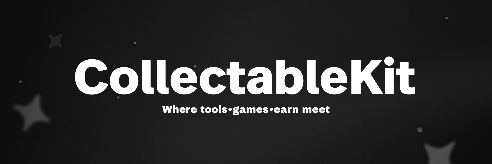
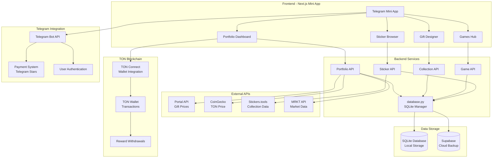

<p align="center"></p>

<div align="center">

# CollectibleKIT

### Your Complete Telegram Gift & Sticker Management Platform

<br/>

[](https://telegram.org/blog/telegram-stars)
[](https://nextjs.org/)
[](https://www.python.org/)
[](https://ton.org/)
[](LICENSE)

</div>

<br/>

<div align="center">
<a href="https://youtu.be/rPYZdzh5t1U">

</a>
<br>
<p><i>Click to watch CollectibleKIT in action</i></p>
</div>

<br/>

<div align="center">
<table>
<tr>
<td align="center"><br><b>Gift Designer</b></td>
<td align="center"><br><b>Emoji Game</b></td>
<td align="center"><br><b>Zoom Game</b></td>
<td align="center"><br><b>Story Game</b></td>
</tr>
</table>
</div>

<br/>

> [!TIP]
> **New!** Track your Telegram gift portfolio in real-time with live TON prices, profit/loss analytics, and custom sticker collections. Built for collectors, by collectors.

---

## Overview

CollectibleKIT is a comprehensive **Telegram Mini App** that brings professional portfolio management and creative tools to Telegram gift and sticker collectors. Track your collection's value, design custom gifts, play interactive games, and manage everything in one beautiful interface.

**Built on TON Blockchain. Powered by Telegram Stars.**

### Key Capabilities

- **📊 Portfolio Tracker**: Real-time gift valuation with TON price integration
- **🎨 Gift Designer**: Create custom gifts with 93+ templates and patterns
- **🎮 Interactive Games**: Emoji quiz, zoom challenge, and story builder
- **💎 Sticker Manager**: Track 218+ sticker collections with live prices
- **💰 Premium System**: Telegram Stars payment integration
- **🔗 TON Wallet**: Connect your TON wallet for withdrawals
- **📈 Analytics**: Profit/loss tracking, price charts, and market insights

---

## Features

### Portfolio Management

Track your entire Telegram gift collection with professional-grade analytics:

- **Live Valuation**: Real-time portfolio value in TON and USD
- **Price Charts**: Historical price data with 1D, 1W, 1M, 3M, 1Y views
- **Profit/Loss**: Track gains and losses across your collection
- **Gift Metadata**: Detailed info on 93+ Telegram gifts
- **Channel Gifts**: Monitor gifts in your channels
- **Account Gifts**: Track gifts sent to specific accounts
- **Custom Collections**: Organize gifts your way

### Gift Designer Tool

Create stunning custom gift designs with professional tools:

- **93+ Gift Templates**: Choose from all Telegram gift types
- **Pattern Library**: Hundreds of emoji patterns and designs
- **Model Variations**: Multiple design variations per gift
- **Backdrop Colors**: Custom color schemes and gradients
- **Real-time Preview**: See your design instantly
- **Export Options**: Download as PNG or share directly
- **Collection Management**: Save and organize your designs

### Interactive Games

Three engaging games to test your gift knowledge:

#### 🎯 Emoji Game
- Guess the gift from emoji patterns
- Daily challenges with leaderboards
- Earn credits for correct answers
- 93+ gifts to discover

#### 🔍 Zoom Game
- Identify gifts from zoomed-in details
- Progressive difficulty levels
- Time-based scoring
- Compete with friends

#### 📖 Story Game
- Build stories with gift pieces
- Creative storytelling mode
- Share your creations
- Community voting

### Sticker Collections

Comprehensive sticker collection management:

- **218+ Collections**: Track all major Telegram sticker packs
- **Live Prices**: Real-time floor prices from Stickers.tools
- **Supply Data**: Monitor availability and rarity
- **Collection Browser**: Organized by artist and theme
- **Price Alerts**: Get notified of price changes
- **Marketplace Links**: Direct access to MRKT and Palace

### Premium Features

Unlock advanced capabilities with Telegram Stars:

- **Ad-Free Experience**: Clean, distraction-free interface
- **Priority Support**: Get help faster
- **Advanced Analytics**: Deeper insights into your portfolio
- **Custom Branding**: Personalize your profile
- **Early Access**: New features before everyone else
- **99 Stars/Month**: Affordable premium access

### TON Integration

Full TON blockchain integration for seamless transactions:

- **Wallet Connect**: Link your TON wallet via TON Connect
- **Reward Withdrawals**: Cash out game credits to TON
- **Transaction History**: Track all your TON transactions
- **Secure Payments**: End-to-end encrypted transactions
- **Multi-Wallet**: Support for all major TON wallets

---

## Tech Stack

### Frontend
- **Next.js 16**: React framework with App Router
- **TypeScript**: Type-safe development
- **Tailwind CSS**: Utility-first styling
- **TON Connect**: Wallet integration
- **Telegram SDK**: Mini App integration
- **Lottie**: Smooth animations

### Backend
- **Python 3.12+**: Core backend services
- **FastAPI**: High-performance API framework
- **SQLite**: Local database storage
- **Supabase**: Cloud database backup
- **Telethon**: Telegram API client

### APIs & Services
- **Portal API**: Gift price data
- **MRKT API**: Market analytics
- **Stickers.tools**: Sticker collection data
- **CoinGecko**: TON price feeds
- **Telegram Bot API**: Bot functionality

---

## System Architecture



---

## Project Structure

```
CollectibleKIT/
├── frontend/                    # Next.js Mini App
│   ├── src/
│   │   ├── app/                # App Router pages
│   │   │   ├── api/           # API routes (54 endpoints)
│   │   │   ├── page.tsx       # Home page
│   │   │   └── layout.tsx     # Root layout
│   │   ├── components/        # React components
│   │   ├── lib/               # Utilities
│   │   └── styles/            # Global styles
│   ├── public/                # Static assets
│   └── package.json           # Dependencies
│
├── backend/                     # Python Backend
│   ├── core/                  # Core functionality
│   │   ├── database.py        # Database manager
│   │   ├── telegram_bot.py    # Bot logic
│   │   ├── payment.py         # Payment processing
│   │   └── ton_wallet.py      # TON integration
│   ├── services/              # External API clients
│   │   ├── portal_market_api.py
│   │   ├── get_gift_price.py
│   │   └── get_sticker_profile.py
│   ├── scripts/               # Utility scripts
│   │   ├── start_bot.py
│   │   └── backup.py
│   └── utils/                 # Helper functions
│
├── data/                        # Sticker Collections
│   ├── pudgy_penguins/        # 218+ collections
│   ├── dogs_og/               # Organized by artist
│   └── not_pixel/             # With metadata
│
├── assets/                      # Static Assets
│   ├── Gift Collection Images/ # 93+ gift images
│   └── svg icons/             # UI icons
│
├── config/                      # Configuration
│   ├── .env.example           # Environment template
│   └── netlify.toml           # Deployment config
│
└── docs/                        # Documentation
    ├── PITCH_DECK.txt         # Project overview
    └── NETLIFY_READY_SUMMARY.txt
```

---

## Getting Started

### Prerequisites

- Node.js 18+ and npm
- Python 3.12+
- Telegram Bot Token
- TON Wallet (optional)

### Installation

1. **Clone the repository**
```bash
git clone https://github.com/yourusername/CollectibleKIT.git
cd CollectibleKIT
```

2. **Setup Frontend**
```bash
cd frontend
npm install
cp ../config/.env.example .env.local
# Edit .env.local with your configuration
```

3. **Setup Backend**
```bash
cd ../backend
pip install -r ../requirements.txt
cp ../config/.env.example .env
# Edit .env with your Telegram bot token
```

4. **Run Development Server**
```bash
# Frontend (in frontend/ directory)
npm run dev

# Backend (in backend/ directory)
python scripts/start_bot.py
```

5. **Open in Telegram**
- Add your bot to Telegram
- Open the Mini App
- Start tracking your collection!

### Environment Variables

Create `.env` files based on the examples in `config/`:

**Frontend (.env.local)**
```env
NEXT_PUBLIC_BOT_USERNAME=your_bot_username
NEXT_PUBLIC_APP_URL=https://your-app.com
```

**Backend (.env)**
```env
TELEGRAM_BOT_TOKEN=your_bot_token
TELEGRAM_API_ID=your_api_id
TELEGRAM_API_HASH=your_api_hash
SUPABASE_URL=your_supabase_url
SUPABASE_KEY=your_supabase_key
```

---

## Deployment

### Vercel (Recommended for Frontend)

```bash
cd frontend
npm run build
vercel deploy
```

### Netlify

```bash
cd frontend
npm run build
netlify deploy --prod
```

### Backend Deployment

The Python backend can run on any VPS:

```bash
# Using systemd service
sudo cp config/app.service.example /etc/systemd/system/collectiblekit.service
sudo systemctl enable collectiblekit
sudo systemctl start collectiblekit
```

---

## API Documentation

### Portfolio Endpoints

- `GET /api/portfolio/gifts` - Get user's gift collection
- `GET /api/portfolio/preload` - Preload portfolio data
- `GET /api/portfolio/profit-loss` - Calculate P&L
- `GET /api/portfolio/gift-chart` - Get price chart data
- `GET /api/portfolio/gift-metadata` - Get gift details

### Collection Endpoints

- `GET /api/collection/gifts` - List all available gifts
- `GET /api/collection/backdrops` - Get backdrop colors
- `POST /api/collection/save` - Save custom collection
- `GET /api/collection/load` - Load saved collection

### Game Endpoints

- `GET /api/game/daily-question` - Get daily challenge
- `POST /api/game/submit-answer` - Submit game answer
- `GET /api/game/random-gift` - Get random gift for game
- `GET /api/game/models` - Get gift models
- `GET /api/game/patterns` - Get gift patterns

### Premium Endpoints

- `GET /api/premium/status` - Check premium status
- `POST /api/premium/upgrade` - Purchase premium
- `GET /api/credits/conversions` - Get credit history

See full API documentation in the code comments.

---

## Contributing

Contributions are welcome! Please feel free to submit a Pull Request.

1. Fork the repository
2. Create your feature branch (`git checkout -b feature/AmazingFeature`)
3. Commit your changes (`git commit -m 'Add some AmazingFeature'`)
4. Push to the branch (`git push origin feature/AmazingFeature`)
5. Open a Pull Request

---

## License

This project is licensed under the MIT License - see the [LICENSE](LICENSE) file for details.

---

## Acknowledgments

- **Telegram** - For the amazing Mini App platform
- **TON Foundation** - For blockchain infrastructure
- **Portal Market** - For gift price data
- **Stickers.tools** - For sticker collection data
- **The Community** - For feedback and support

---

<div align="center">

### Built for Telegram Gift Collectors

*CollectibleKIT is a community project. We appreciate your feedback and contributions!*

<sub>Made with ❤️ for the Telegram ecosystem</sub>

<br/>

[](https://t.me/yourusername)
[](https://github.com/yourusername)

</div>
